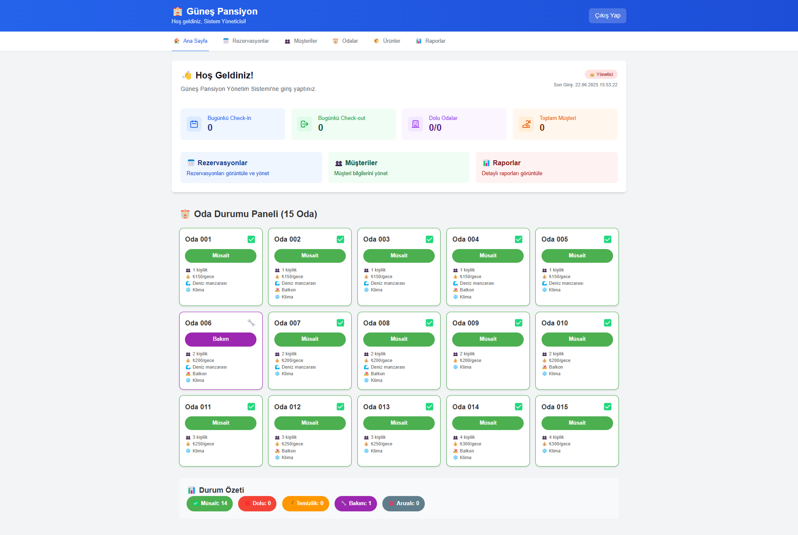

<div align="center">
  <br />
  <p>
    <a href="#">
      <!-- Logo eklenebilir:  -->
    </a>
  </p>
  <h1 align="center"><b>Pansiyon Yönetim Sistemi</b></h1>
  <p align="center">
    Küçük ve orta ölçekli konaklama işletmeleri için modern, tam özellikli bir yönetim platformu.
    <br />
    <a href="#"><strong>Canlı Demo »</strong></a>
    ·
    <a href="https://github.com/saffetcelik/pansiyon-yonetim-sistemi/issues">Hata Bildir</a>
    ·
    <a href="https://github.com/saffetcelik/pansiyon-yonetim-sistemi/issues">Özellik İste</a>
  </p>
</div>

<p align="center">
  
  
  
  
</p>

---

## 📖 Proje Hakkında

**Pansiyon Yönetim Sistemi**, konaklama sektöründeki işletmelerin operasyonel verimliliğini artırmak amacıyla geliştirilmiş, açık kaynaklı ve modern bir web uygulamasıdır. Oda yönetimi, müşteri ilişkileri, rezervasyon takibi, finansal raporlama ve satış işlemleri gibi birçok süreci dijitalleştirir.

Bu platform, güncel teknolojiler ve en iyi yazılım geliştirme pratikleriyle hem geliştiriciler için esnek bir altyapı hem de son kullanıcılar için sezgisel bir arayüz sunar.

---

## 🚀 Temel Özellikler

- **Oda Yönetimi:** Oda ekleme, düzenleme, durum takibi (müsait/dolu/bakımda/temizlikte), fiyatlandırma, özellikler (balkon, deniz manzarası, klima, minibar, TV, WiFi).
- **Rezervasyon Modülü:** Yeni rezervasyon oluşturma, güncelleme, iptal, check-in/check-out işlemleri, rezervasyon arama ve filtreleme, takvim görünümü.
- **Müşteri Yönetimi:** Müşteri kaydı, bilgileri güncelleme, arama ve filtreleme, geçmiş rezervasyonlar.
- **Satış ve Ürün Yönetimi:** Büfe/ekstra satış noktası, ürün ekleme/düzenleme, stok takibi, satış işlemleri, indirim ve notlar.
- **Finansal Raporlama:** Günlük/aylık gelir-gider, ödeme yöntemleri analizi, kategori bazlı raporlar, kasa bakiyesi, trend analizleri.
- **Fatura ve Ödeme Takibi:** Fatura oluşturma, ödeme kaydı, ödeme türleri (nakit, kredi kartı, havale vb.), ödeme durumu takibi.
- **Kullanıcı ve Rol Yönetimi:** Farklı roller (admin, yönetici, çalışan), JWT tabanlı kimlik doğrulama, rol bazlı erişim kontrolü.
- **Gelişmiş API:** Swagger/OpenAPI dokümantasyonu, RESTful uç noktalar.
- **Duyarlı ve Modern Arayüz:** React 19 + Tailwind CSS ile tasarlanmış, mobil uyumlu ve hızlı kullanıcı deneyimi.

---

## 🏗️ Teknoloji Yığını

- **Backend:** ASP.NET Core 8, Entity Framework Core, JWT, AutoMapper
- **Frontend:** React 19, Redux, Tailwind CSS, Axios
- **Veritabanı:** PostgreSQL
- **Diğer:** Docker desteği, Swagger API dokümantasyonu

---

## 🖼️ Ekran Görüntüsü



---

## ⚡ Kurulum ve Çalıştırma

Projeyi yerel ortamınızda çalıştırmak için aşağıdaki adımları takip edin:

### Gereksinimler

- [.NET 8 SDK](https://dotnet.microsoft.com/download/dotnet/8.0)
- [Node.js (LTS)](https://nodejs.org/)
- [PostgreSQL](https://www.postgresql.org/download/) veya [Docker](https://www.docker.com/products/docker-desktop/)

### Kurulum Adımları

1. **Veritabanı Kurulumu:**
   - PostgreSQL sunucusu kurun ve yeni bir veritabanı oluşturun.
   - `backend/appsettings.json` dosyasındaki bağlantı ayarlarını güncelleyin.
2. **Backend’i Başlatma:**
   ```bash
   cd backend
   dotnet restore
   dotnet ef database update  # İlk kez çalıştırırken
   dotnet run
   ```
3. **Frontend’i Başlatma:**
   ```bash
   cd frontend
   npm install
   npm start
   ```
4. **Giriş:**
   - Varsayılan yönetici hesabı veya ilk kullanıcı kaydı ile giriş yapın.

> **Not:** Docker ile tam kurulum için `docker-compose` desteği eklenebilir.

---

## 👤 Kullanıcı Rolleri ve Yetkilendirme

- **Admin:** Tüm sistem ayarlarına ve verilere tam erişim.
- **Yönetici:** Oda, rezervasyon, müşteri, satış ve rapor yönetimi.
- **Çalışan:** Sadece kendi görevleriyle ilgili modüllere erişim (ör. check-in/out, satış işlemleri).
- **Kimlik Doğrulama:** JWT tabanlı, güvenli oturum yönetimi.

---

## 🛠️ Ana Modüller

### Backend (ASP.NET Core)
- `Controllers/`: Oda, rezervasyon, müşteri, ürün, satış, ödeme ve kimlik doğrulama API uç noktaları
- `Models/`: Temel veri modelleri (Room, Reservation, Customer, Sale, Payment, Product, User)
- `Services/`: İş mantığı ve yardımcı servisler (ör. raporlama, JWT, stok)
- `DTOs/`: Veri transfer nesneleri
- `Migrations/`: EF Core veritabanı şeması yönetimi

### Frontend (React)
- `src/pages/`: Ana sayfalar (Dashboard, Reservations, Customers, Products, Sales, Debug)
- `src/components/`: Tekil arayüz bileşenleri (RoomPanel, ReservationList, CustomerList, ProductList, Modals)
- `src/store/`: Redux durum yönetimi

---

## 🔌 API ve Entegrasyonlar

- **RESTful API:** Tüm temel işlemler için uç noktalar (CRUD)
- **Swagger:** Otomatik API dokümantasyonu için `/swagger` yolu
- **Kimlik Doğrulama:** JWT ile korunan uç noktalar
- **Frontend-Backend Bağlantısı:** Axios ile HTTP istekleri

---

## 🗺️ Yol Haritası

Gelecekte eklenmesi planlanan özellikler ve iyileştirmeler için [Proje Yol Haritası](semantic_roadmap.md) belgesine göz atın. Topluluk tarafından istenen özellikler için [Issues](https://github.com/saffetcelik/pansiyon-yonetim-sistemi/issues) sayfasını takip edebilirsiniz.

---

## 🤝 Katkıda Bulunma

Katkılarınızı memnuniyetle karşılıyoruz! Lütfen katkı rehberini ve kodlama standartlarını inceleyin. Hata raporları, yeni özellik önerileri veya doğrudan kod katkısı için [Issues](https://github.com/saffetcelik/pansiyon-yonetim-sistemi/issues) ve [Pull Requests](https://github.com/saffetcelik/pansiyon-yonetim-sistemi/pulls) bölümlerini kullanabilirsiniz.

---

## 📄 Lisans

Bu proje [MIT Lisansı](LICENSE) ile lisanslanmıştır.

---

## 📬 İletişim

Her türlü soru, öneri veya destek için [issue açabilir](https://github.com/saffetcelik/pansiyon-yonetim-sistemi/issues) veya doğrudan proje sahibiyle iletişime geçebilirsiniz.

### ⚙️ Kurulum Adımları

1.  **Projeyi Klonlayın:**
    ```sh
    git clone https://github.com/saffetcelik/pansiyon-yonetim-sistemi.git
    cd pansiyon-yonetim-sistemi
    ```

2.  **Veritabanını Ayarlayın:**
    *   `backend/appsettings.Development.json` dosyasını açın.
    *   `ConnectionStrings.Default` alanını kendi PostgreSQL bağlantı bilgilerinizle güncelleyin.

3.  **Backend'i Çalıştırın:**
    <details>
      <summary>Terminal Komutları</summary>
      
      ```sh
      cd backend
      
      # Gerekli EF Core CLI aracını kurun
      dotnet tool install --global dotnet-ef
      
      # Veritabanı tablolarını oluşturun
      dotnet ef database update
      
      # API'yi başlatın
      dotnet run
      ```
    </details>
    API, `https://localhost:5000` adresinde çalışmaya başlayacaktır.

4.  **Frontend'i Çalıştırın:**
    <details>
      <summary>Terminal Komutları</summary>
      
      ```sh
      # Yeni bir terminal açın
      cd frontend
      
      # Bağımlılıkları yükleyin
      npm install
      
      # Geliştirme sunucusunu başlatın
      npm start
      ```
    </details>
    Uygulama arayüzü `http://localhost:3000` adresinde açılacaktır.

---

## 🛠️ Teknoloji Mimarisi

| Katman     | Teknoloji                                                              |
| :--------- | :--------------------------------------------------------------------- |
| **Ön Uç**    | `React 19`, `Redux Toolkit`, `React Router`, `MUI`, `Tailwind CSS`     |
| **Arka Uç**  | `ASP.NET Core 8`, `Entity Framework Core 9`, `AutoMapper`, `JWT`       |
| **Veritabanı** | `PostgreSQL`                                                         |
| **Test**     | `xUnit` (Backend), `React Testing Library` (Frontend)                  |
| **DevOps**   | `Swagger`, `Docker`, `GitHub Actions`                                |

---

## 🗺️ Yol Haritası

Gelecekte eklenmesi planlanan özellikler ve iyileştirmeler için [Proje Yol Haritası](semantic_roadmap.md) belgesine göz atın. Topluluk tarafından istenen özellikler için [Issues](https://github.com/saffetcelik/pansiyon-yonetim-sistemi/issues) sayfasını takip edebilirsiniz.

---

## 🤝 Katkıda Bulunma

Katkılarınız, bu projeyi daha iyi bir hale getirmemize yardımcı olur. Fikirlerinizi, hata bildirimlerinizi veya kod katkılarınızı bekliyoruz!

1.  Projeyi Fork'layın.
2.  Yeni bir özellik dalı oluşturun (`git checkout -b feature/AmazingFeature`).
3.  Değişikliklerinizi commit'leyin (`git commit -m 'Add some AmazingFeature'`).
4.  Dalınızı push'layın (`git push origin feature/AmazingFeature`).
5.  Bir Pull Request açın.


---

## 📄 Lisans

Bu proje **MIT Lisansı** ile lisanslanmıştır. Daha fazla bilgi için [LICENSE](LICENSE) dosyasına bakın.

---
